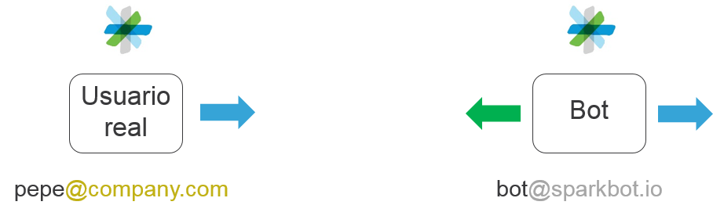
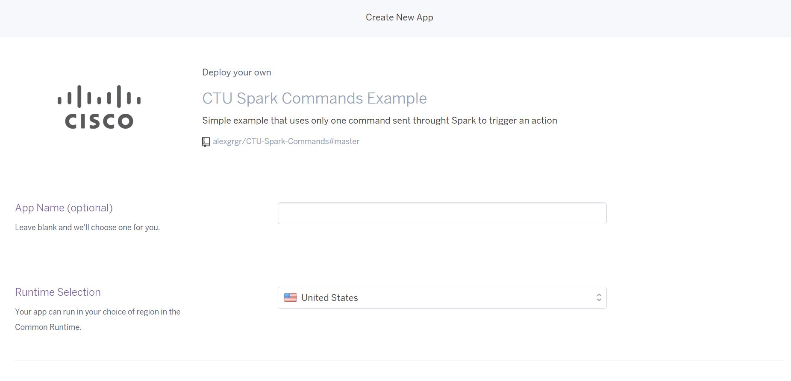
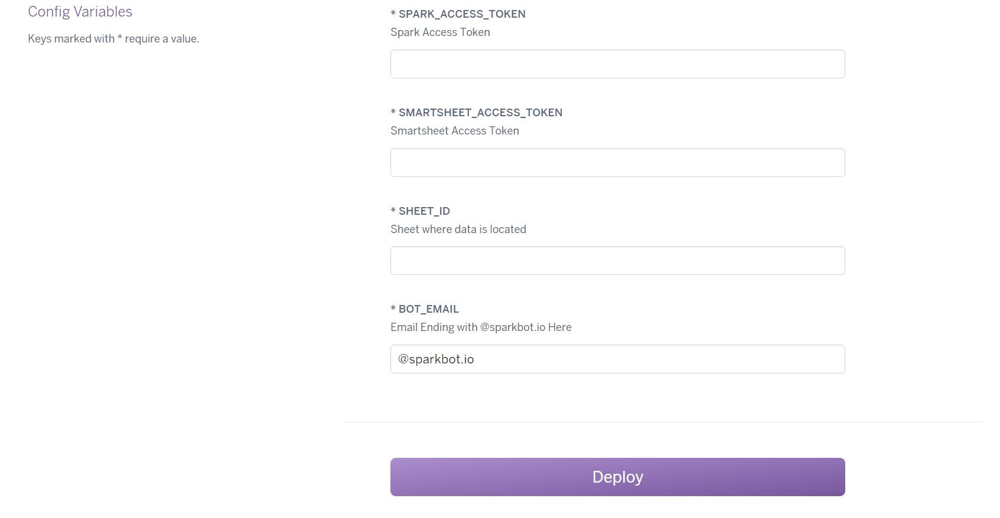

# CTU Spark Commands Example

## Simple example that uses only one command sent throught *Spark* to trigger an action

This example demonstrates how you can use a simple command to make the bot retreive data for you from an external source, throught the use of RESTfull APIs.

###Use case

A user needs to ask something very important, and in order to give him a fast answer, you want to deploy a bot that is able of understanding this question and give him an answer.

But neither the bot knows the answer. As the data is confidential, the only place where you can store it is on a *Smartsheet*, so the bot will need to access
*Smartseet* throught it´s own API.

This first example will guide you throught the discovery of the necessary services for the next steps, such as Github, Heroku and the development platform of Spark.

##Preparation Steps

1. **Create a bot in Spark**

In Spark's terms, a bot is a fake user account that serves as a frontend with a real user, that will send all messages received to an application, which will then process this information in order to serve as a useful tool to this user.



So first step would be to create this fake account. By accessing the Spark's Developer Platform you can create as many bots as you would need. Please, go to [Documentation->Creating a Spark Bot](https://developer.ciscospark.com/bots.html#creating-a-spark-bot-account "Create Bot and Generate Access Token") and follow the steps.

 > Write down the access token for a later use.

 3. **Prepare your Smartsheet's Token**

 This data will be given to you. Smartsheet is a very useful Spreadsheet with a
 powerfull search engine. It will be used emulating a Database.

 > Write down the access token for a later use.
 > Also, write down the sheet ID
 >
3. **Prepare a PaaS (*Platform as a Service*) for executing the code that will compose your bot.**

We are going to use *Heroku*, a very simple an easy to use Platform as a Service. This kind of service will allow you to upload your code in a variety of languages avoiding the need of configuring machines, operating systems, etc.

In *Heroku* terms, your app is contained in a so called Dyno, an isolated, virtualized Unix container, that provide the environment required to run an application.

The code published here at Github can be easily contanerized so you will not have to code and just focus on how it works.

Follow this link to create a Dyno and deploy the necessary code:

[](https://heroku.com/deploy)

You will be presented with a page as follow:



+ Select Your App name and save it for later use. Also reffered as Dyno Name on this text.
+ Runtime selection choose Europe
+ You will also need to set this *environmental variables*:


|                Variable | Value                                                            |
|------------------------:|:-----------------------------------------------------------------|
| SMARTSHEET_ACCESS_TOKEN | Your *Smartsheet*´s Token to access *API*                        |
|                SHEET_ID | The *Smartsheet*'s sheet ID were info is located                 |
|      SPARK_ACCESS_TOKEN | Your bot´s Token to access *Spark* *API*                         |
|               BOT_EMAIL | Your bot´s email to discard its own messages                     |

+ Deploy!


4. **Set a WebHook to your Dyno in Spark**

Finally, in order to link Spark with your app you will need to set a target where Spark will send all messages received by the bot. This is called a **Webhook**. Please refer to the following documentation:
 [*Spark WebHook Creation*](https://developer.ciscospark.com/endpoint-webhooks-post.html "Create an Spark Webhook").

You will notice on the left side of the above web the construction of the JSON message needed by Spark in order to contact it's API:

```JSON
{
  "name" : "My Awesome Webhook",
  "targetUrl" : "https://example.com/mywebhook",
  "resource" : "messages",
  "event" : "created",
  "filter" : "roomId=Y2lzY29zcGFyazovL3VzL1JPT00vYmJjZWIxYWQtNDNmMS0zYjU4LTkxNDctZjE0YmIwYzRkMTU0",
  "secret" : "86dacc007724d8ea666f88fc77d918dad9537a15"
}
```
Clicking on the scroll button you will change the mode to test mode. This allows a developer to send API messages directly from the web browser, instead of using a developer tool.

Your message needs to look this way:
```JSON
{
  "name" : "CTU Spark Commands Example",
  "targetUrl" : "https://[yourdynoname].herokuapp.com/webhook",
  "resource" : "messages",
  "event" : "created",
}
```
So you must set the following parameters:
+ **name**: `CTU Spark Commands Example`
+ **targetUrl**: where `[yourdynoname]` is the name given before to your Dyno
+ **resource**: `message`
+ **event**: `created`

> Now Spark knows where on the internet it must send the messages refered to your bot

##Ready

+ Any time your bot is reffered in a Space, or chatted on a 1-to-1 Space, Spark will send a WebHook to `https://[yourdynoname].herokuapp.com/webhook`
+ Your Dyno is composed of some *Python* code over a web framework called *Flask*. Everytime a `GET` http request is received on the URL path `/webhook`, some code will be executed.
+ First of all, the WebHook does not include the message. Instead, an `messageId` is provided. So in order to have it, a `GET` http request is sent to Spark.
+ Then, the message `/search [something]` from a user will be decompossed into the command and the query.
+ This logic will be applied:

    **If `/search` exists, then search `[something]` in Google Spreadsheet**

    **If `/search` does not exists, respond the user with the error**

+ End of the code, wait for next message.
